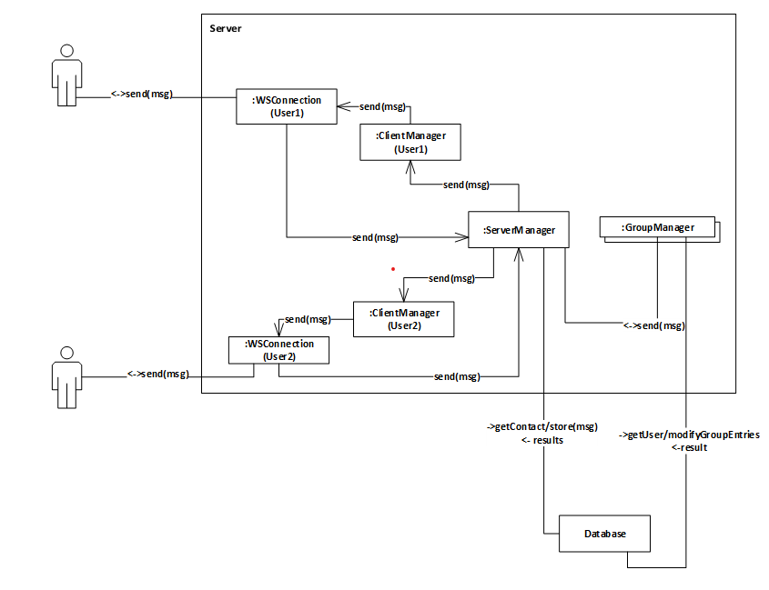

# Message-Server
The figure below show thecomponents and how they communicate with each other.

Each Project conists of the following components :
- ServerManager

    forwards messages received by the WebSocket or
other managers to the correct endpoint, i.e., either the UserManager or GroupManager. If no
manager currently exists for the message, e.g., when a user is offline the ServerManager stores the message in the database.
- UserManager

    manages the messages of one user and uses the WebSocket connection to send
messages to the user.
- GroupManager

   manages the message of a particular group.

---

## Functionalities
- Login/register
- Send messages to users or groups
- Retrieve message sent from users and groups
- Create or remove groups
- Add users to groups
- Join groups
- Leave groups

---