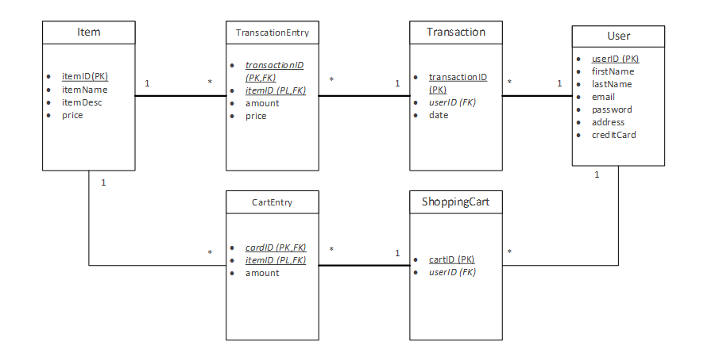

## Webshop

Below is the database structure of that is used by both Node.js and JavaEE

•   Item: The items that are offered for purchase in the web shop.

•   User: The registered users.

•   ShoppingCart: The current shopping cart of registered users.

•   CartEntry: Contains the item entries of the shopping carts.

•   Transactions: Contains purchases of the users. 

•   TransactionsEntry: Contains all item entries from the performed purchases.

---
The user can perform the following actions :
- Login/Logout
- Register a new user
- Search for Items
- Add/ Remove Items from the cart
- Initiate a checkout
- View the shopping cart
- View previously performed purchases 

